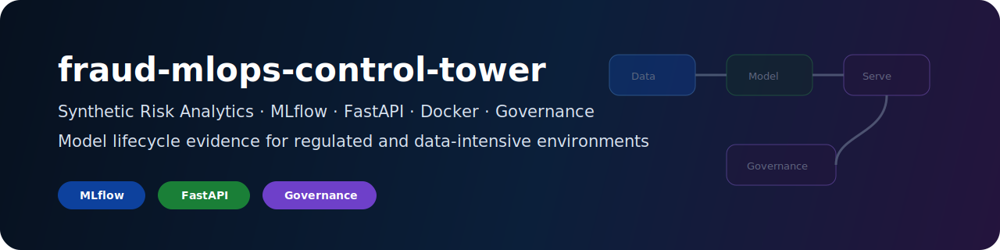
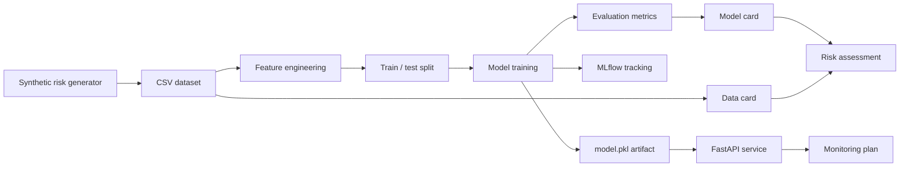

# fraud-mlops-control-tower

<div align="center">



<br/>

**Synthetic risk/anomaly analytics project with MLOps, monitored serving and model governance**

Python · scikit-learn · MLflow · FastAPI · Docker · CI/CD · Model Card · Data Card


</div>

---

## Executive summary

`fraud-mlops-control-tower` is a public MLOps portfolio project demonstrating a full synthetic model lifecycle for risk/anomaly analytics:

```text
synthetic risk events -> features -> model training -> evaluation -> MLflow tracking -> FastAPI serving -> monitoring plan -> governance docs
```

The project is designed for regulated and data-intensive environments: banking, insurance, health insurance, reinsurance, pharma/medtech, fintech, consulting and big-tech data platforms.

No real banking, insurance, health, client, employer or private data belongs here.

---

## Target roles

| Role family | Why this project helps |
|---|---|
| Junior Data Scientist | feature engineering, imbalanced metrics, threshold analysis |
| Junior MLOps Engineer | MLflow, FastAPI, Docker, tests, CI, runbooks |
| Risk / Fraud Analytics Analyst | anomaly-style model evaluation and false-positive/false-negative thinking |
| AI Platform Engineer Junior | model lifecycle, serving, monitoring, governance evidence |
| Insurance / Claims Analytics | synthetic claims/risk-style modeling patterns |
| Big-tech ML/data platforms | packaging, API contracts, testability and reproducibility |

---

## Architecture



---

## Quickstart

```bash
make install
make generate
make train
make evaluate
make test
make lint
```

Run API locally:

```bash
make api
```

Then open:

```text
http://localhost:8000/docs
```

Example prediction:

```bash
curl -X POST http://localhost:8000/predict \
  -H "Content-Type: application/json" \
  -d @examples/sample_prediction_payload.json
```

Run MLflow UI:

```bash
make mlflow-ui
```

---

## Repository structure

```text
fraud-mlops-control-tower/
├── README.md
├── PORTFOLIO.md
├── Dockerfile
├── docker-compose.yml
├── pyproject.toml
├── Makefile
├── .env.example
├── .github/workflows/ci.yml
├── assets/fraud-mlops-banner.svg
├── data/
├── examples/
├── notebooks/
├── src/fraud_mlops/
├── tests/
├── docs/
├── artifacts/
└── reports/
```

---

## Metrics

This project does not optimize for accuracy alone. It reports metrics appropriate for imbalanced risk/anomaly problems:

| Metric | Why it matters |
|---|---|
| Precision | controls false positives |
| Recall | controls missed anomalies |
| F1 | balances precision and recall |
| PR-AUC | better for imbalanced labels |
| ROC-AUC | general ranking quality |
| Confusion matrix | operational error analysis |

---

## Public-safety rules

- synthetic data only;
- no real banking, insurance, health, client, employer or private data;
- no production decisioning claims;
- no performance guarantees;
- no investment, credit, insurance or medical advice;
- no CVs, cover letters or job trackers;
- no secrets, tokens, hostnames or private IPs.

---

## Non-goals

This project is not:

- a real fraud engine;
- a production risk system;
- a credit/insurance/health decisioning system;
- a model validated for real-world operations;
- a job application dossier.

---

## Portfolio signal

This repository proves the ability to move from synthetic data to model training, evaluation, API serving, monitoring and governance documentation.
---

## Portfolio layer

This repository is part of the KinSushi public technical portfolio.

| Layer | Evidence |
|---|---|
| MLOps | synthetic risk model, MLflow, FastAPI, Docker, model card and data card |

Detailed cross-repository context: [docs/PORTFOLIO_LAYER.md](docs/PORTFOLIO_LAYER.md)

