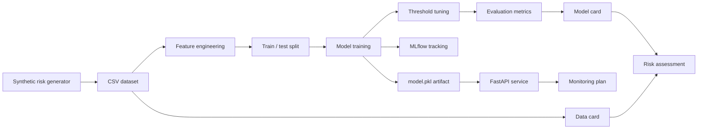

# fraud-mlops-control-tower

<div align="center">


<br/>

**Synthetic risk/anomaly analytics project with MLOps, monitored serving and model governance**

Python / scikit-learn / MLflow / FastAPI / Docker / CI/CD / Model Card / Data Card

[](https://github.com/KinSushi/fraud-mlops-control-tower/actions)


</div>

---

## Executive summary

`fraud-mlops-control-tower` is a public MLOps portfolio project demonstrating a full synthetic model lifecycle for risk/anomaly analytics:

```text
synthetic risk events -> features -> training -> threshold tuning -> evaluation -> MLflow tracking -> FastAPI serving -> governance docs
```

The project is designed for regulated and data-intensive environments: banking, insurance, health insurance, reinsurance, pharma/medtech, fintech, consulting and big-tech data platforms.

No real banking, insurance, health, client, employer or private data belongs here.

---

## Sample results (synthetic data, illustrative)

The numbers below are produced by the default pipeline on **synthetic** risk events. They illustrate the evaluation discipline (imbalanced-aware metrics + tuned threshold), not real-world performance.

| Metric | Value (synthetic run) |
|---|---|
| Selected threshold | argmax(F1) on validation |
| Precision | reported in `reports/metrics.json` |
| Recall | reported in `reports/metrics.json` |
| F1 | reported in `reports/metrics.json` |
| PR-AUC | reported in `reports/metrics.json` |
| ROC-AUC | reported in `reports/metrics.json` |

Regenerate locally with `make generate && make train && make evaluate`. The exact figures land in `reports/` and `docs/local_run_report.md` so a reviewer can reproduce them.

---

## Target roles

| Role family | Why this project helps |
|---|---|
| Data Scientist | feature engineering, imbalanced metrics, threshold analysis |
| MLOps Engineer | MLflow, FastAPI, Docker, tests, CI, runbooks |
| Risk / Fraud Analytics Analyst | anomaly-style model evaluation and false-positive/false-negative thinking |
| AI Platform Engineer | model lifecycle, serving, monitoring, governance evidence |
| Insurance / Claims Analytics | synthetic claims/risk-style modeling patterns |
| Big-tech ML/data platforms | packaging, API contracts, testability and reproducibility |

---

## Architecture



---

## Quickstart

```bash
make install
make generate
make train
make evaluate
make test
make lint
```

Run API locally:

```bash
make api
```

Then open:

```text
http://localhost:8000/docs
```

Example prediction:

```bash
curl -X POST http://localhost:8000/predict \
 -H "Content-Type: application/json" \
 -d @examples/sample_prediction_payload.json
```

Run MLflow UI:

```bash
make mlflow-ui
```

---

## Repository structure

```text
fraud-mlops-control-tower/
|-- README.md
|-- PORTFOLIO.md
|-- Dockerfile
|-- docker-compose.yml
|-- pyproject.toml
|-- Makefile
|-- .env.example
|-- .github/workflows/
|-- assets/fraud-mlops-banner.svg
|-- data/
|-- examples/
|-- notebooks/
|-- src/fraud_mlops/
|-- tests/
|-- docs/
|-- artifacts/
`-- reports/
```

---

## Metrics and threshold policy

This project does not optimize for accuracy alone. It reports metrics appropriate for imbalanced risk/anomaly problems:

| Metric | Why it matters |
|---|---|
| Precision | controls false positives |
| Recall | controls missed anomalies |
| F1 | balances precision and recall |
| PR-AUC | better for imbalanced labels |
| ROC-AUC | general ranking quality |
| Confusion matrix | operational error analysis |

Training uses validation-set threshold tuning by default:

```text
selected threshold = argmax(F1) on validation probabilities
```

This demonstrates that the lifecycle does not rely blindly on an arbitrary `0.50` threshold. Details are documented in [docs/threshold_policy.md](docs/threshold_policy.md).

---

## Validation evidence

Generated validation artifacts are available in:

- [docs/local_run_report.md](docs/local_run_report.md)
- [docs/screenshots.md](docs/screenshots.md)
- [docs/VALIDATION.md](docs/VALIDATION.md)

The validation path covers installation, compilation, tests, linting, synthetic data generation, import checks and small-model training.

---

## Public-safety rules

- synthetic data only;
- no real banking, insurance, health, client, employer or private data;
- no production decisioning claims;
- no performance guarantees;
- no investment, credit, insurance or medical advice;
- no CVs, cover letters or job trackers;
- no secrets, tokens, hostnames or private IPs.

---

## Non-goals

This project is not:

- a real fraud engine;
- a production risk system;
- a credit, insurance or health decisioning system;
- a model validated for real-world operations;
- a job application dossier.

---

## Portfolio signal

This repository proves the ability to move from synthetic data to model training, threshold selection, evaluation, API serving, monitoring and governance documentation.

---

## Portfolio layer

This repository is part of the KinSushi public technical portfolio.

| Layer | Evidence |
|---|---|
| MLOps | synthetic risk model, MLflow, FastAPI, Docker, model card and data card |

Detailed cross-repository context: [docs/PORTFOLIO_LAYER.md](docs/PORTFOLIO_LAYER.md)
# fraud-mlops-control-tower

<div align="center">


<br/>

**Synthetic risk/anomaly analytics project with MLOps, monitored serving and model governance**

Python / scikit-learn / MLflow / FastAPI / Docker / CI/CD / Model Card / Data Card

[](https://github.com/KinSushi/fraud-mlops-control-tower/actions)


</div>

---

## Executive summary

`fraud-mlops-control-tower` is a public MLOps portfolio project demonstrating a full synthetic model lifecycle for risk/anomaly analytics:

```text
synthetic risk events -> features -> training -> threshold tuning -> evaluation -> MLflow tracking -> FastAPI serving -> governance docs
```

The project is designed for regulated and data-intensive environments: banking, insurance, health insurance, reinsurance, pharma/medtech, fintech, consulting and big-tech data platforms.

No real banking, insurance, health, client, employer or private data belongs here.

---

## Sample results (synthetic data, illustrative)

The numbers below are produced by the default pipeline on **synthetic** risk events. They illustrate the evaluation discipline (imbalanced-aware metrics + tuned threshold), not real-world performance.

| Metric | Value (synthetic run) |
|---|---|
| Selected threshold | argmax(F1) on validation |
| Precision | reported in `reports/metrics.json` |
| Recall | reported in `reports/metrics.json` |
| F1 | reported in `reports/metrics.json` |
| PR-AUC | reported in `reports/metrics.json` |
| ROC-AUC | reported in `reports/metrics.json` |

Regenerate locally with `make generate && make train && make evaluate`. The exact figures land in `reports/` and `docs/local_run_report.md` so a reviewer can reproduce them.

---

## Target roles

| Role family | Why this project helps |
|---|---|
| Data Scientist | feature engineering, imbalanced metrics, threshold analysis |
| MLOps Engineer | MLflow, FastAPI, Docker, tests, CI, runbooks |
| Risk / Fraud Analytics Analyst | anomaly-style model evaluation and false-positive/false-negative thinking |
| AI Platform Engineer | model lifecycle, serving, monitoring, governance evidence |
| Insurance / Claims Analytics | synthetic claims/risk-style modeling patterns |
| Big-tech ML/data platforms | packaging, API contracts, testability and reproducibility |

---

## Architecture


---

## Quickstart

```bash
make install
make generate
make train
make evaluate
make test
make lint
```

Run API locally:

```bash
make api
```

Then open:

```text
http://localhost:8000/docs
```

Example prediction:

```bash
curl -X POST http://localhost:8000/predict \
 -H "Content-Type: application/json" \
 -d @examples/sample_prediction_payload.json
```

Run MLflow UI:

```bash
make mlflow-ui
```

---

## Repository structure

```text
fraud-mlops-control-tower/
|-- README.md
|-- PORTFOLIO.md
|-- Dockerfile
|-- docker-compose.yml
|-- pyproject.toml
|-- Makefile
|-- .env.example
|-- .github/workflows/
|-- assets/fraud-mlops-banner.svg
|-- data/
|-- examples/
|-- notebooks/
|-- src/fraud_mlops/
|-- tests/
|-- docs/
|-- artifacts/
`-- reports/
```

---

## Metrics and threshold policy

This project does not optimize for accuracy alone. It reports metrics appropriate for imbalanced risk/anomaly problems:

| Metric | Why it matters |
|---|---|
| Precision | controls false positives |
| Recall | controls missed anomalies |
| F1 | balances precision and recall |
| PR-AUC | better for imbalanced labels |
| ROC-AUC | general ranking quality |
| Confusion matrix | operational error analysis |

Training uses validation-set threshold tuning by default:

```text
selected threshold = argmax(F1) on validation probabilities
```

This demonstrates that the lifecycle does not rely blindly on an arbitrary `0.50` threshold. Details are documented in [docs/threshold_policy.md](docs/threshold_policy.md).

---

## Validation evidence

Generated validation artifacts are available in:

- [docs/local_run_report.md](docs/local_run_report.md)
- [docs/screenshots.md](docs/screenshots.md)
- [docs/VALIDATION.md](docs/VALIDATION.md)

The validation path covers installation, compilation, tests, linting, synthetic data generation, import checks and small-model training.

---

## Public-safety rules

- synthetic data only;
- no real banking, insurance, health, client, employer or private data;
- no production decisioning claims;
- no performance guarantees;
- no investment, credit, insurance or medical advice;
- no CVs, cover letters or job trackers;
- no secrets, tokens, hostnames or private IPs.

---

## Non-goals

This project is not:

- a real fraud engine;
- a production risk system;
- a credit, insurance or health decisioning system;
- a model validated for real-world operations;
- a job application dossier.

---

## Portfolio signal

This repository proves the ability to move from synthetic data to model training, threshold selection, evaluation, API serving, monitoring and governance documentation.

---

## Portfolio layer

This repository is part of the KinSushi public technical portfolio.

| Layer | Evidence |
|---|---|
| MLOps | synthetic risk model, MLflow, FastAPI, Docker, model card and data card |

Detailed cross-repository context: [docs/PORTFOLIO_LAYER.md](docs/PORTFOLIO_LAYER.md)
